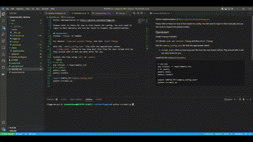

Python implementation of https://github.com/dend/foggycam.

Please refer to there for how to find inputs for config. You will need to login to Nest manually and use dev tools to inspect the packet/cookies. 

## Quickstart
Install `ffmpeg` if needed.

For Ubuntu: `sudo apt install ffmpeg` and then `which ffmpeg`

Edit the `camera_config.json` file with the appropriate values.
- `stream_limit` refers to how long each file from the nest stream will be. Play around with it and see what works for you.

Install the libs using `pip` or `poetry`
```shell
# use pip
pip install -r requirements.txt
# or poetry
poetry shell
poetry install

export CONFIG_FP="camera_config.json"
python src/main.py
```
